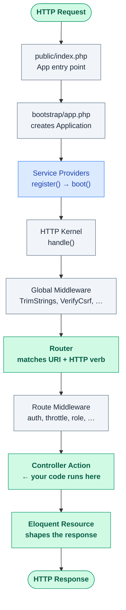

---json
{
    "order": 2,
    "title": "Laravel Request Lifecycle: What Happens Before Your Code Runs",
    "type": "reading",
    "description": "Most juniors treat Laravel as magic. Understanding the lifecycle — from index.php to the Response — is what separates problem-solvers from tutorial-followers. We dissect bootstrap, Service Providers, the IoC Container, and how middleware forms a pipeline.",
    "tldr": "Every HTTP request walks the same eight-stage road: index.php → Application → Service Providers → HTTP Kernel → global middleware → router → route middleware → your controller. Knowing where you are on that road turns \"Laravel is magic\" debugging into \"I can put a breakpoint anywhere\".",
    "difficulty": "intermediate",
    "estimated_minutes": 22,
    "challenge_slug": null,
    "lab_url": null,
    "has_playground": true,
    "playground_starter_code": "<?php\ndeclare(strict_types=1);\n\n// A toy middleware that logs each request's path + duration.\n// Copy this into app/Http/Middleware/ in a real Laravel app and\n// register it in bootstrap/app.php to see it in your laravel.log.\n\nclass LogRequestDuration\n{\n    public function handle(\\Illuminate\\Http\\Request $request, \\Closure $next)\n    {\n        $startedAt = microtime(true);\n\n        // ── Pre-handle phase: runs BEFORE the controller. Authentication,\n        //    rate limiting, header massaging all happen here.\n        \\Log::info('→ request', ['path' => $request->path()]);\n\n        $response = $next($request);  // ← controller (and everything after) runs here\n\n        // ── Post-handle phase: runs AFTER the response is built.\n        //    Logging, header injection, span finalisation belong here.\n        $durationMs = (int) ((microtime(true) - $startedAt) * 1000);\n        \\Log::info('← response', [\n            'path' => $request->path(),\n            'status' => $response->getStatusCode(),\n            'duration_ms' => $durationMs,\n        ]);\n\n        return $response;\n    }\n}\n\necho \"Middleware skeleton compiled OK\\n\";",
    "challenge_prompt": null,
    "resources": [
        {
            "url": "https://laravel.com/docs/lifecycle",
            "label": "Laravel Request Lifecycle"
        },
        {
            "url": "https://laravel.com/docs/container",
            "label": "Service Container"
        },
        {
            "url": "https://laravel.com/docs/providers",
            "label": "Service Providers"
        },
        {
            "url": "https://laravel.com/docs/middleware",
            "label": "Middleware"
        }
    ],
    "instructions": [
        {
            "id": 1,
            "text": "Trace a real request — in a fresh Laravel app, add a route that returns 'hi'. Put dd(microtime(true)) calls in: bootstrap/app.php, your AppServiceProvider's boot(), the route definition. Compare the timestamps to see exactly how much time is spent in each phase.",
            "starter_code": null
        },
        {
            "id": 2,
            "text": "Write a request-duration middleware — implement RequestTimer that logs request method/path/status/duration_ms via Log::info. Register it as global middleware. Confirm it fires for every route by hitting two endpoints and reading storage/logs/laravel.log.",
            "starter_code": "<?php\ndeclare(strict_types=1);\n\nnamespace App\\Http\\Middleware;\n\nuse Closure;\nuse Illuminate\\Http\\Request;\nuse Illuminate\\Support\\Facades\\Log;\n\nclass RequestTimer\n{\n    public function handle(Request $request, Closure $next)\n    {\n        // TODO: capture microtime(true) before calling $next.\n        // TODO: call $next($request) to get the response.\n        // TODO: log method, path, response status, duration_ms.\n        // TODO: return the response.\n    }\n}"
        },
        {
            "id": 3,
            "text": "Spot the register vs boot bug — given the snippet below, explain why putting Gate::define in register() can crash on certain Laravel versions, then fix it by moving the call to boot().",
            "starter_code": "<?php\ndeclare(strict_types=1);\n\nnamespace App\\Providers;\n\nuse Illuminate\\Support\\Facades\\Gate;\nuse Illuminate\\Support\\ServiceProvider;\n\nclass AuthServiceProvider extends ServiceProvider\n{\n    public function register(): void\n    {\n        // BUG: Auth-related services may not exist yet when register() runs.\n        // Gate facade resolves the AuthManager from the container, which\n        // depends on the session, which depends on the cookie service, etc.\n        Gate::define('manage-billing', fn ($user) => $user->hasRole('admin'));\n    }\n\n    public function boot(): void\n    {\n        // TODO: move the Gate::define call here.\n    }\n}"
        },
        {
            "id": 4,
            "text": "Container singleton vs bind — given an InvoiceClock that returns now(), explain what changes if you register it as singleton vs bind. Then think about Octane: which one is the footgun and why? Senior interview territory.",
            "starter_code": "<?php\ndeclare(strict_types=1);\n\n// In a real provider you would do either:\n// $this->app->bind(InvoiceClock::class, fn () => new InvoiceClock());\n// $this->app->singleton(InvoiceClock::class, fn () => new InvoiceClock());\n\nclass InvoiceClock\n{\n    public readonly \\DateTimeImmutable $bornAt;\n\n    public function __construct()\n    {\n        $this->bornAt = new \\DateTimeImmutable();\n    }\n\n    public function now(): \\DateTimeImmutable\n    {\n        return $this->bornAt;  // ← deliberately stale; mirrors a real bug we want to expose\n    }\n}\n\n// Simulate two requests by resolving the clock twice with a small sleep.\n$clockA = new InvoiceClock();\nsleep(1);\n$clockB = new InvoiceClock();   // ← in singleton mode you'd get the SAME instance here\n\necho $clockA->now()->format('H:i:s.u') . PHP_EOL;\necho $clockB->now()->format('H:i:s.u') . PHP_EOL;"
        },
        {
            "id": 5,
            "text": "Walk-through interview drill — write a 10-step walk-through of what happens between submitting a login form (POST /login) and the user seeing the dashboard. One sentence per step, no skipping middleware or the response phase. Read it back; if it sounds memorised rather than reasoned, that's exactly what an interviewer will catch.",
            "starter_code": null
        }
    ],
    "prerequisites": [
        {
            "id": 1,
            "title": "Modern PHP: Types, Nullables and Enums"
        },
        {
            "id": 2,
            "title": "Basic Laravel routing & controllers"
        }
    ],
    "concepts": [
        "lifecycle",
        "service-providers",
        "ioc-container",
        "middleware",
        "http-kernel",
        "service-resolution"
    ],
    "quiz": null,
    "evidence": null
}
---
## Core (PHP fundamentals)

### The journey of a request

Every request to a Laravel app walks the same road. Burn this picture into your head — it tells you where to put a breakpoint when something goes wrong.



If you're debugging a 500 and don't know which arrow to inspect first, you're guessing. After this step you should be able to point at one box and say *"the bug is between here and here"*.

### The entry point

Every web request first hits `public/index.php`. It does four things in order:

```php
require __DIR__.'/../vendor/autoload.php';

$app = require_once __DIR__.'/../bootstrap/app.php';

$app->handleRequest(Request::capture());
```

1. **Autoload** PSR-4 classes through Composer.
2. **Build** the `Application` instance (the IoC container).
3. **Capture** the incoming HTTP request into an `Illuminate\Http\Request`.
4. **Run** it through the HTTP Kernel.

Everything else is sugar on top of these four lines.

### Service Providers — register vs boot

A Service Provider is the bridge between *features Laravel ships with* and *your application's bindings*. Each provider runs two phases:

```php
class AppServiceProvider extends ServiceProvider
{
    // register(): bind things into the container.
    // The container isn't fully populated yet — DO NOT use other services here.
    public function register(): void
    {
        $this->app->singleton(BillingClient::class, fn () => new StripeBillingClient(
            config('services.stripe.secret')
        ));
    }

    // boot(): everything is registered. Now you can safely USE other services.
    public function boot(): void
    {
        Gate::define('manage-billing', fn ($user) => $user->hasRole('admin'));
    }
}
```

If you put `Gate::define` inside `register()`, the Auth service might not exist yet and your app crashes at boot time. The two-phase split is the framework's way of avoiding circular dependencies.

### Middleware pipeline

Middleware sits *between* the request reaching the router and your controller running. Each middleware can:

- **Reject** the request early (return a response without calling `$next`).
- **Mutate** the request before the controller sees it.
- **Mutate** the response before the client sees it.

```php
public function handle(Request $request, Closure $next)
{
    // pre-handle phase
    if (! $request->bearerToken()) {
        return response()->json(['error' => 'unauthenticated'], 401);
    }

    $response = $next($request);

    // post-handle phase
    $response->headers->set('X-Trace-Id', request()->header('X-Trace-Id', uniqid()));
    return $response;
}
```

The `$next($request)` call is the seam: everything before it runs on the way **in**, everything after runs on the way **out**. Authentication, rate limiting, and request rewriting belong before; logging, header injection and tracing belong after.

## Deeper dive (container internals)

### Bindings: `bind`, `singleton`, `instance`, `scoped`

The container has four primary registration modes. Pick wrong and you either leak state or pay for object construction on every request:

| Method                       | New instance per resolve? | Lives for…          | Use when…                                                |
| ---------------------------- | ------------------------- | ------------------- | -------------------------------------------------------- |
| `bind`                       | Yes                       | One resolve         | The dependency holds per-request state (request stamper, transient builder). |
| `singleton`                  | No                        | The whole process   | The dependency is stateless or expensive to build (HTTP clients, DB connections via the factory). |
| `instance`                   | No                        | The whole process   | You already have the object and just want to register it. |
| `scoped`                     | No                        | One request/job     | Per-request caching (the request id, an idempotency key store). Octane-safe. |

Choosing `singleton` for a stateful service is the classic Octane footgun: state from one request leaks into the next. When you migrate a Laravel app to Octane, every `singleton` becomes suspect.

### Contextual binding

Same interface, different implementation depending on who's asking:

```php
$this->app
    ->when(EmailNotifier::class)
    ->needs(MailerInterface::class)
    ->give(ResendMailer::class);

$this->app
    ->when(InvoiceJob::class)
    ->needs(MailerInterface::class)
    ->give(SmtpMailer::class);
```

`EmailNotifier` gets the Resend client (fast, transactional). `InvoiceJob` gets the SMTP client (slower but uses the audit-logged corporate relay). The consumer doesn't change; the wiring does.

### Route caching and what it actually caches

`php artisan route:cache` serialises the matched route definitions to a single file. It doesn't cache responses. The big gotcha: **closure-based routes can't be cached** — they aren't serialisable. If your bootstrap suddenly fails in production, that's almost always why. Convert closures to controller actions before caching.

### The deferred-loading optimisation

Service Providers run on every request by default. If you only need a provider when a specific job runs, mark it `deferred`:

```php
class HeavyAnalyticsProvider extends ServiceProvider implements DeferrableProvider
{
    public function provides(): array
    {
        return [AnalyticsClient::class];
    }
}
```

The provider's `register()` won't fire until something type-hints `AnalyticsClient`. For background jobs that don't touch analytics, you skip the bootstrap cost entirely.

## Senior insights (debugging & interview prep)

### Reading a Laravel stack trace efficiently

When prod 500s, you have a 60-line stack trace. The trick: read from the **bottom up** until you cross the framework/app boundary. Every line under `vendor/laravel/framework/...` is the framework calling your code; the first line in `app/` is *your* bug.

Practical tools:

- `dd(debug_backtrace())` shows the same trace inline if you want to inspect a path without raising an exception.
- `\Log::stack(['daily'])->channel('errors')->debug(...)` for production-safe instrumentation.
- The `Throwable::getPrevious()` chain matters — the root cause is usually 2-3 wrappers deep (request → controller → service → repository → DB exception).

### Common interview question: *"Walk me through what happens when you submit a form."*

A senior answer hits these beats in order — short, no umm-ing:

1. The browser POSTs to a URL. The web server (nginx/Apache) forwards to PHP-FPM which calls `public/index.php`.
2. `bootstrap/app.php` builds the Application container.
3. Service Providers register (and then boot) — anything your app depends on becomes resolvable.
4. The HTTP Kernel runs global middleware: `TrimStrings`, `VerifyCsrfToken`, `EncryptCookies`, etc.
5. The router matches the URI to a route definition.
6. Route middleware runs: `auth`, `throttle`, custom role checks.
7. Your controller resolves its dependencies through the container (constructor and method injection) and runs.
8. The controller returns something the framework wraps in `Symfony\Component\HttpFoundation\Response`.
9. The response walks back through every middleware that ran on the way in — this time their post-handle phase fires.
10. PHP-FPM emits the response; the web server returns it to the browser.

If you can recite that flow and pin a known framework feature (Sanctum's `EnsureFrontendRequestsAreStateful`, the new bootstrap/app.php fluent API) to each step, you're already past the senior bar most interviewers set.

### Anti-patterns seniors flag at code review

- **Container access inside loops.** `app(Foo::class)` resolves once per iteration. Inject once at the top.
- **`request()` and `auth()` helpers deep inside service classes.** Couples the service to the HTTP cycle and makes it untestable from a queue worker. Inject what you need explicitly.
- **Global middleware doing per-route work.** Authentication for an entire app belongs in global middleware. Authentication for `/admin/*` belongs on the route group. Mixing them is how you accidentally protect the wrong routes after a refactor.
- **`Schema::create` in a service provider.** Service providers run on boot; migrations belong in migrations. Mixing them creates "works locally, doesn't work in production".

### Custom middleware design tips

When you write your own middleware:

- Make the constructor injection explicit — no `app()` lookups.
- Return early on rejection. Don't carry state past `$next($request)` if you don't need to.
- If you mutate the request, add a clear `data-injected-by` header or a span attribute so the next person can find where the mutation happened.

Middleware is the cleanest place to attach cross-cutting telemetry (trace ids, request logs). Resist the temptation to put business logic there — it runs on every request, including ones that have nothing to do with the feature.
